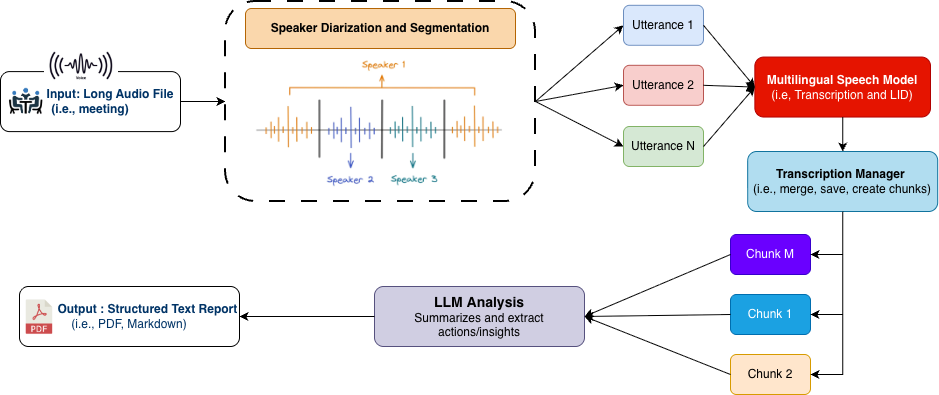

**InterPARES-Audio** is an automated, end-to-end pipeline that transforms complex, lengthy audio files into structured, insightful text

## Workflow

## Code
[Jupyter Notebook ](https://github.com/UBC-NLP/InterPARES_audio/blob/main/multilingual_audio_analysis.ipynb)

## Examples
 [Meering report, Markdown](https://github.com/UBC-NLP/InterPARES_audio/blob/main/meeting_reports/A05195/meeting_analysis_A05195-20251010_174134-English.md)

 [Meering report, PDF](https://github.com/UBC-NLP/InterPARES_audio/blob/main/meeting_reports/A05195/meeting_analysis_A05195-20251010_174134-English.pdf)
